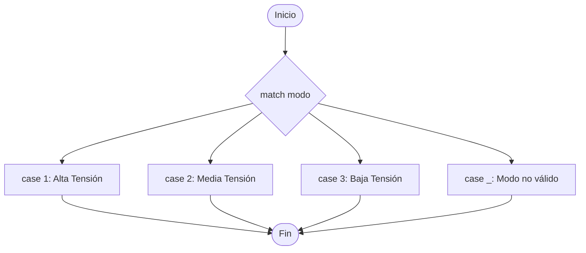

# Condicionales

## Introducción

Las estructuras condicionales son herramientas esenciales en programación que permiten que un programa tome decisiones y realice diferentes acciones basadas en ciertas condiciones. Utilizando declaraciones "`if`", "`else`" y "`elif`" (abreviatura de "`else if`" en inglés), los condicionales permiten que un programa ejecute diferentes bloques de código según si una expresión booleana es verdadera o falsa. Estas estructuras son fundamentales para controlar el flujo de un programa y para automatizar decisiones basadas en datos y lógica. En esencia, los condicionales son la forma en que los programas pueden responder y adaptarse a diferentes situaciones en función de la información que tienen disponible.

## Lectura 1: Operadores relacionales

Recuerda la actividad anterior, donde aprendiste el funcionamiento de los operadores relacionales. Recuerda que el resultado de una operación de este tipo siembre es *booleano*. Te dejo una tabla de resumen con los operadores que vas a necesitar para esta unidad.


*Figura 1. Operadores relacionales*

### Ejercicio 1

Comprueba en la consola de Python los siguientes códigos

```python
print(10 > 5)
print("Hola" != "Mundo")
print(3.14 <= 4.5)
nombre = "Juan"
print(nombre == "Juan")
```

# Condicionales

<aside>
 **Existen tres tipos de condicionales:**

- Simple
- Doble
- Múltiple
</aside>

## Lectura 2: Condicional simple

Se utilizan cuando se requiere realizar un procedimiento únicamente en el caso de cumplir una condición. Si no se cumple la condición, simplemente se obvia el procedimiento. Observa la figura 2, la cual es una representación de diagrama de flujo del condicional simple:


*Figura 2. Diagrama de flujo del condicional simple*

Condición simple usa la palabra `if`, que significa “`si`” (condicional) y evalúa si una condición es verdadera y de ser así ejecuta las instrucciones dentro del bloque de código.

<aside>
💡 **Nota**: Un bloque de código en Python se caracteriza por tener el mismo nivel de `indentación`.

</aside>

La figura 3 muestra la sintaxis que se utiliza en Python. Debes recordar los dos puntos que van luego de la condición y el bloque de código al mismo nivel de indentación:


*Figura 3. Sintaxis del condicional simple*

### Ejercicio 2

Resuelve el siguiente problema usando el condicional simple.

Un almacén cobra `$9 000` por costos de envío, pero ofrece el envío a domicilio gratis para compras superiores a `$100 000`. En caso contrario, no hay ningún descuento. Solicite al usuario el valor de la compra y calcule el valor total a pagar.

### Análisis del problema

Para resolver este problema, te propongo analizarlo usando un diagrama de flujo. Este tipo de diagramas son muy útiles para entender la manera como se va ejecutando el programa, es decir, su flujo de ejecución. 


*Figura 4. Diagrama de flujo de la solución*

Ahora intenta escribir el código de la solución en lenguaje Python.

<aside>
🛠 **Nota**: A continuación te dejo una posible implementación. Antes de mirar la solución intenta resolver el problema tú mismo.

</aside>

```python
envio = 0
compra = int(input("Ingrese el valor de la compra>> "))
if compra < 100000:
	envio = 9000
total = compra + envio
print(f"El total de la compra es {total}")
```

<aside>
⚠️

**Advertencia**
Recuerda que `=` es para asignar valores, mientras que `==` es para comparar.

</aside>

### Lectura 3: Condicional doble

Se utilizan cuando existen dos posibilidades. Al evaluar el condicional, la opción verdadera da como resultado un procedimiento y la opción falsa otro diferente. La lógica puede ser positiva o negativa.


*Figura 5. Diagrama de flujo del condicional doble*

Observe a continuación la sintaxis de este condicional:

```python
if condicion:
	se ejecuta si se	la condición es verdadera
else:
	se ejecuta la condición es falsa
```

### Ejercicio 3

Determine si un número ingresado por el usuario es par o impar.

### Análisis del problema

Observe el diagrama de flujo de la solución del problema:


*Figura 6. Diagrama de flujo para determinar si un número es par o impar*

Ahora intenta escribir el código de la solución en lenguaje Python.

<aside>
🛠 **Nota**: A continuación te dejo una posible implementación. Antes de mirar la solución intenta resolver el problema tú mismo.

</aside>

```python
n = int(input("Ingresa un número entero>> "))
r = n%2     #se calcula el residuo de la división entre 2
if r != 0:
	print(f"{n} es impar")
else:
	print(f"{n} es par")
```

### Lectura 4: Condicional múltiple

Se utilizan cuando las opciones son más de dos. En algunos lenguajes de programación, existen comandos específicos, por ejemplo en los lenguajes `C` y `C++` existe el comando `switch()`. En Python se deben utilizar condicionales dobles, según la cantidad de opciones.

Observa la figura 7, es un diagrama de flujo que representa el condicional múltiple. Cada una de las diferentes opciones que se pueden tomas, se puede realizar mediante un condicional doble. 


*Figura 7. Representación del condicional múltiple mediante diagrama de flujo*

### Ejercicio 4

El Ministerio de Salud clasifica las personas según las etapas del ciclo de vida, con el fin de tener una idea sobre su vulnerabilidad. Diseñe un algoritmo que pida al usuario su edad y la clasifique según la etapa del ciclo de vida que le corresponda. Verifique que el usuario no ingrese valores menores a cero. Clasificación etaria de la población colombiana:

- Infancia [0-6) años)
- Niñez [6 - 12) años)
- Adolescencia (12 - 20 años)
- Juventud (20 - 25 años)
- Adultez (25- 60 años)
- Ancianidad / Vejez (60 años o más)

Trata de escribir tu propia versión antes de revisar la solución. 

<aside>
⚠️ Propón tu solución

</aside>

### Ejercicio 6

Una compañía de paquetería internacional tiene servicio en algunos países según su zona. El costo por el servicio de paquetería se basa en el peso del paquete y la zona a la que va dirigido. Parte de su política implica que los paquetes con un peso superior a 5 kg no son transportados por seguridad. Usa la siguiente tabla para resolver el problema:

| Zona | Ubicación | Costo/gramo |
| --- | --- | --- |
| 1 | América del Norte | $11 |
| 2 | América Central | $10 |
| 3 | América del Sur | $12 |
| 4 | Europa | $24 |
| 5 | Asia | $27 |

Te dejo el diagrama de flujo de la solución:


### Ejercicios para practicar

1. Crear un Menú donde se puedan elegir las cinco operaciones aritméticas básicas: `+ - * / %`
2. Solicite al usuario un número entre 1 y 7, según la opción elegida, imprima en pantalla el día de la semana correspondiente. 1 corresponde al lunes.
3. Diseña un programa que solicite al usuario la distancia en kilómetros del vuelo y el consumo de combustible por kilómetro de la aeronave. Luego, el programa debe calcular la carga de combustible requerida y mostrarla. Sin embargo, ten en cuenta que en vuelos comerciales se suele incluir un margen de seguridad adicional en la carga de combustible para afrontar posibles desvíos o retrasos. Por lo tanto, si la distancia del vuelo es menor o igual a 1000 km, se añadirá un 10% adicional a la carga de combustible calculada. Si la distancia es mayor a 1000 km, se añadirá un 15% adicional.

## Match-Case (Versión de Switch en Python 3.10+)

En Python 3.10 y versiones posteriores, existe la **instrucción `match-case`** que funciona de manera similar a `switch-case` en otros lenguajes.

```python
# Ejemplo 3: Control de un modo de operación
modo = 2

match modo:
    case 1:
        print("Modo 1 seleccionado: Alta Tensión")
    case 2:
        print("Modo 2 seleccionado: Media Tensión")
    case 3:
        print("Modo 3 seleccionado: Baja Tensión")
    case _:
        print("Modo no válido")
```

> Nota: case _ cumple la función de default (si ningún caso coincide).
> 



---

## 8. Ejemplo de Menú con `match-case`

```python
print("=== MENÚ PRINCIPAL ===")
print("1. Ver datos de sensores")
print("2. Configurar parámetros")
print("3. Salir")

opcion = int(input("Selecciona una opción: "))

match opcion:
    case 1:
        print("Mostrando datos de sensores...")
    case 2:
        print("Entrando a configuración...")
    case 3:
        print("Saliendo del programa...")
    case _:
        print("Opción inválida.")
```

> Objetivo: Probar el uso de match-case como alternativa al if-elif-else.
> 

---

## 9. Ejercicio Propuesto

**Menú Repetitivo**

1. Crea un menú de opciones (por ejemplo, 1: "Sumar", 2: "Restar", 3: "Salir").
2. Utiliza `while True:` para **mantener** el menú **hasta** que el usuario elija "Salir".
3. Emplea `match-case` (o `if-elif-else` si no tienes Python 3.10+) para gestionar cada opción.

**ℹ️ Pregunta de Control**

- ¿Cómo harías para terminar el bucle cuando el usuario elija "Salir"?
- ¿En qué momento leerías la opción de usuario de nuevo para que el menú aparezca repetidamente?

---

## 10. Ejercicios Adicionales

1. **Verificar contraseña**
    - Pide al usuario que ingrese una contraseña.
    - Si es correcta, imprimes "Acceso concedido", de lo contrario "Acceso denegado".
    - Usa `if-else`.
2. **Clasificar calificaciones**
    - Pide al usuario una nota (0 a 5).
    - Usa `if-elif-else` para clasificar (por ejemplo, 0-2 "Baja", 3-4 "Media", 5 "Alta").
3. **Operación aritmética**
    - Pide al usuario dos números y una opción: `+`, , , `/`.
    - Utiliza `match-case` o `if-elif-else` para realizar la operación y mostrar el resultado.

---

<aside>
🔥

Los condicionales son la base para **tomar decisiones** en tu programa. En Python, tenemos las estructuras `if`, `elif` y `else`, y desde Python 3.10 contamos con `match-case` para simplificar múltiples condiciones.

</aside>