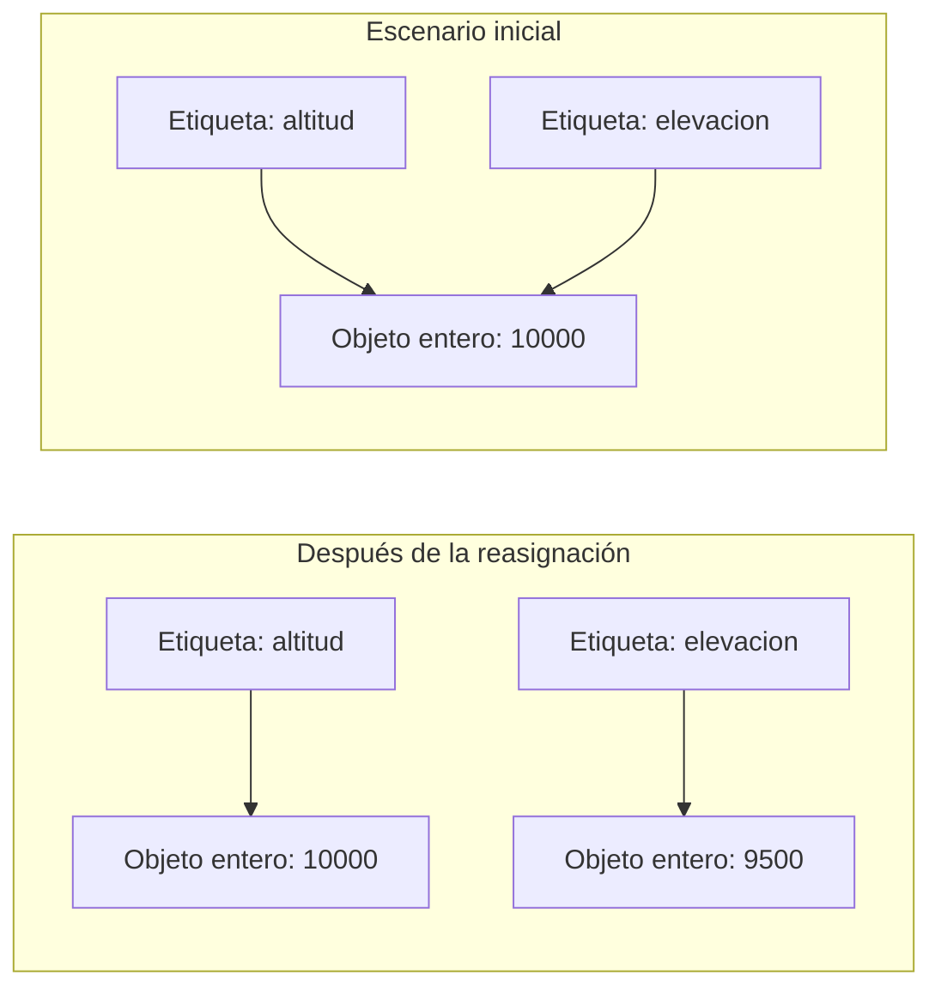

# Lectura 1: Objetos, Variables y Etiquetas

En Python, todo es un objeto. Esta afirmación, aunque simple, es fundamental para entender el lenguaje.

**¿Qué es un objeto?**

Un objeto es una instancia de una clase que encapsula datos (atributos) y comportamientos (métodos). En Python, números, cadenas, funciones e incluso las clases mismas son objetos.

**Variables como etiquetas**

A diferencia de otros lenguajes, en Python las variables no son "contenedores" que almacenan valores, sino "etiquetas" o "nombres" que apuntan a objetos.

En tu editor de código, realiza el siguiente ejercicio y apunta tus conclusiones. 

```python
# Creamos un objeto (en este caso, un número)
altitud = 10000  # metros

# 'altitud' es una etiqueta que apunta al objeto entero 10000
# Podemos crear otra etiqueta que apunte al mismo objeto
elevacion = altitud

# Si modificamos el valor al que apunta 'elevacion'
elevacion = 9500

# 'altitud' sigue apuntando al valor original
print(altitud)  # 10000
print(elevacion)  # 9500
```

Veamos una representación gráfica de lo que sucede:



# **Lectura 2: ID de objetos**

Cada objeto tiene un identificador único que podemos verificar con la función `id()`. Compureba este concepto utilizando el siguiente código. 

```python
velocidad = 800  # km/h
print(id(velocidad))  # Muestra el identificador único del objeto

otra_velocidad = 800
print(id(otra_velocidad))  # Para números pequeños, Python reutiliza objetos

lista1 = [1, 3, 67]
print(id(lista1))
```

Para objetos más complejos, Python creará objetos separados aunque tengan el mismo valor.

# Lectura 3: Mutabilidad vs Inmutabilidad

La mutabilidad se refiere a si un objeto puede ser modificado después de su creación.

**Objetos Inmutables**: No pueden ser modificados después de su creación. Si parece que los estamos modificando, en realidad estamos creando nuevos objetos.

- Ejemplos: números (int, float), strings, tuplas, frozensets

**Objetos Mutables**: Pueden ser modificados después de su creación.

- Ejemplos: listas, diccionarios, sets

### Ejemplo con objetos inmutables (strings):

```python
modelo = "Boeing 747"
print(id(modelo))  # Guardamos el ID original

# Intentamos "modificar" el string
modelo = modelo + "-800"
print(modelo)  # "Boeing 747-800"
print(id(modelo))  # ¡ID diferente! Se creó un nuevo objeto
```

### Ejemplo con objetos mutables (listas):

```python
componentes = ["alas", "fuselaje", "motores"]
print(id(componentes))  # Guardamos el ID original

# Modificamos la lista
componentes.append("tren de aterrizaje")
print(componentes)  # ["alas", "fuselaje", "motores", "tren de aterrizaje"]
print(id(componentes))  # Mismo ID, el objeto fue modificado in-place
```

**Implicaciones en el paso de argumentos**

La mutabilidad afecta cómo se comportan los objetos cuando se pasan como argumentos a funciones.

> Realiza el siguiente ejercicio y explica (en tu bitácora) tu respuesta a la pregunta:
> 

❓**¿Cómo afecta la mutabilidad a los objetos que se usan como argumentos de una función?**

```python
def agregar_combustible(tanques, litros):
    tanques.append(litros)
    print(f"Combustible actualizado: {tanques}")

combustible_actual = [1000, 1200, 800]  # Lista (objeto mutable)
agregar_combustible(combustible_actual, 500)
print(combustible_actual)  # [1000, 1200, 800, 500] - La lista original fue modificada
```

## Iterables e Iteración

**¿Qué es un iterable?**

Un iterable es cualquier objeto Python sobre el cual podemos recorrer sus elementos uno por uno. Técnicamente, un iterable es cualquier objeto que implementa el método `__iter__()` o `__getitem__()`.

### Ejemplos de iterables en Python:

- Listas, tuplas, strings, sets, diccionarios
- Archivos
- Generadores

## **Iteración con bucles for**

La forma más común de iterar es con el bucle `for`:

```python
# Iterando sobre una lista de sensores de aeronave
sensores = ["temperatura", "presión", "velocidad", "altitud", "combustible"]

for sensor in sensores:
    print(f"Comprobando sensor de {sensor}...")
```

## **Iteración con bucles while**

Aunque menos común para recorrer colecciones, podemos usar `while` con un contador:

```python
# Simulando lecturas de altitud cada 10 segundos
altitudes = [0, 100, 500, 1000, 1500, 2000, 2200, 2500]
tiempo = 0
i = 0

while i < len(altitudes):
    print(f"Tiempo: {tiempo}s - Altitud: {altitudes[i]} metros")
    tiempo += 10
    i += 1
```

**Funciones de iteración útiles**

- `enumerate()`: Proporciona índices junto con valores
    
    ```python
    etapas = ["despegue", "ascenso", "crucero", "descenso", "aterrizaje"]
    for i, etapa in enumerate(etapas):
        print(f"Etapa {i+1}: {etapa}")
    ```
    
- `zip()`: Combina dos o más iterables
    
    ```python
    tiempos = [0, 10, 20, 30]
    velocidades = [0, 200, 300, 320]
    
    for t, v in zip(tiempos, velocidades):
        print(f"Tiempo: {t}s - Velocidad: {v} km/h")
    ```
    
- Comprensiones de listas: Forma concisa de crear listas basadas en iterables existentes.

<aside>
🚫

**Nota Importante:** como no es uno de los objetivos del curso, l**as comprensiones no serán utilizadas** en los ejercicios o retos que se desarrollarán como evaluación. 

```python
# Convertir altitudes de pies a metros
altitudes_pies = [10000, 15000, 20000, 25000, 30000]
altitudes_metros = [altura * 0.3048 for altura in altitudes_pies]
print(altitudes_metros)
```

</aside>

Estos fundamentos son esenciales para comprender cómo funcionan las estructuras de datos en Python, que veremos a continuación.